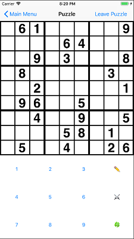
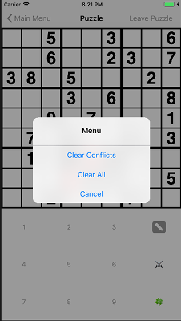

# Sudoku
## WSU Vancouver - CS458 - Project 2
### iOS/Swift Project
### Screenshots

### Abstract
[Sudoku](https://en.wikipedia.org/wiki/Sudoku) is a logic-based 9x9 grid based number-placement puzzle so that each region contains all of the digits from 1 to 9.  The app will start up in a view allowing the user to select whether they wish to start an easy or hard puzzle. If the user had a game in progress, they should also have the option to continue their existing game. Once a selection has been made, you’ll switch to a different view controller presenting the puzzle interface.

More information is in the **/docs** [pdf.](docs/sudoku.pdf)
### Testbed
Built and simulated on a *MacOS Sierra 10.12.6*, *XCode 9.2 (9C40b)* compiler and tested on *Simulator v10.0*.
### TODO
 - Incomplete error checking
 - Inconsistant crashing

### Note
All code licenced MIT with exception to SudokuView.swift and docs/ folder.